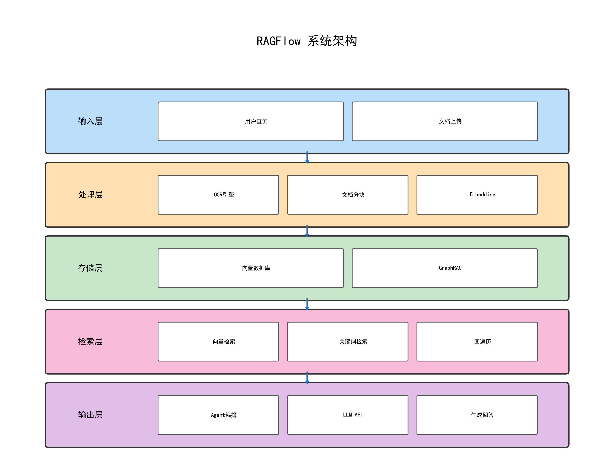
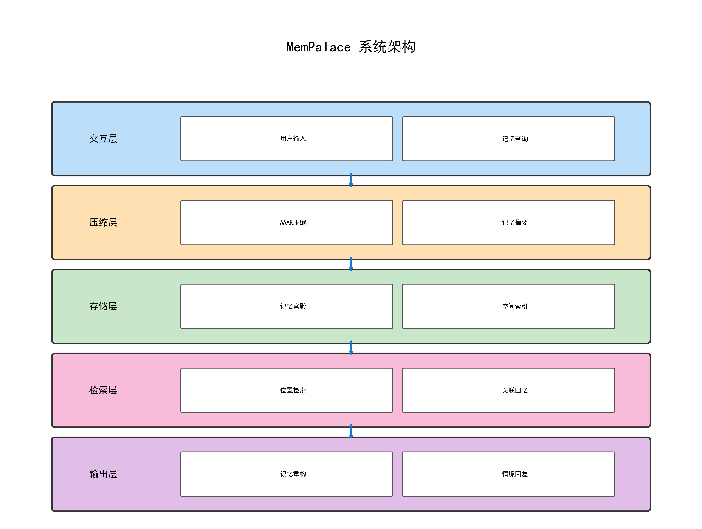
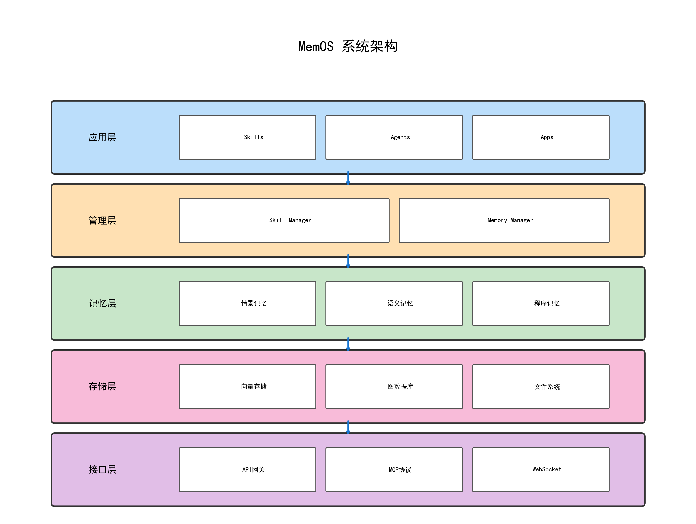

# AI记忆系统分析报告

## 1. 项目概述

本报告对比分析了7个主流AI记忆系统，包括RAGFlow、qmd、MemPalace、MemOS、M-FLOW、Claude插件和EverMind MSA。

### 1.1 对比维度

- 适用场景
- 资源消耗
- 稳定性
- 执行效率
- 部署复杂性

## 2. 系统架构

### 2.1 RAGFlow 架构

RAGFlow 是一个企业级RAG引擎，采用模块化架构设计。

### 2.2 MemPalace 架构

MemPalace 是史上评分最高的AI记忆系统，采用记忆宫殿架构。

### 2.3 MemOS 架构

MemOS 是一个AI记忆操作系统，支持多种应用和技能。

## 3. 技术特性对比

各系统在技术实现上各有特色：

- **RAGFlow**: GraphRAG + 向量检索
- **MemPalace**: AAAK压缩算法 + 记忆宫殿
- **MemOS**: Skill Manager + 情景/语义记忆
- **M-FLOW**: Cone Graph + 多粒度融合
- **qmd**: 本地索引 + 全文检索

## 4. 选型建议

根据使用场景推荐：

1. 企业级应用 → RAGFlow
2. 本地搜索 → qmd
3. 个人记忆 → MemPalace
4. 多智能体 → MemOS
5. 学术研究 → EverMind MSA
